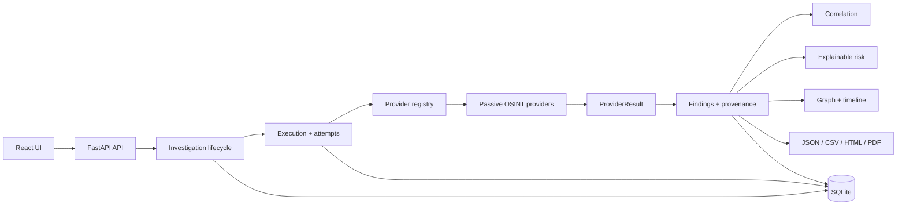

# MailRecon

**Privacy-first Email Intelligence & OSINT Platform**

MailRecon is a local-first defensive investigation workspace for analyzing an email address using public information and legitimate provider APIs. It emphasizes **evidence provenance, provider transparency, explainable risk, and reproducible reports** rather than pretending that an OSINT hit is proof of identity.

[](https://github.com/alathul008/mailrecon/actions/workflows/ci.yml)
[](LICENSE)

## Why this project

MailRecon is built as a portfolio-grade security engineering project around a simple principle: **an observation is evidence, not identity proof**. The application keeps provider execution state separate from intelligence, records provenance for findings, isolates historical execution attempts, and makes risk contributions inspectable.

## Core capabilities

- Email normalization, classification and username candidate generation
- Public DNS analysis: A/AAAA/MX/NS/CNAME, SPF, DMARC and DNSSEC signals
- RDAP domain intelligence
- Gravatar correlation
- GitHub public-profile correlation
- HIBP breach metadata integration when an API key is configured
- Optional local Ollama evidence-grounded summary
- Evidence records with source, confidence, severity and collection time
- Provider execution states: `ok`, `unconfigured`, `rate_limited`, `unavailable`, `error`
- Multidimensional risk model: identity, breach, domain security and public footprint
- Relationship graph and investigation timeline
- JSON, CSV, HTML and PDF reports
- Local SQLite persistence with privacy mode for reducing raw provider payload retention
- SSRF-conscious outbound URL validation and browser/API security headers
- Bearer API-key authentication for protected API endpoints
- CLI and Docker workflow

## Architecture at a glance



The durable execution path is intentionally explicit: **investigation → execution attempt → provider registry → ProviderResult → findings → correlation/risk → graph/timeline/report**. Provider failures are represented as operational states instead of being silently converted into negative intelligence.

See [`docs/architecture.md`](docs/architecture.md) for the component-level description and [`docs/security.md`](docs/security.md) for the security model.

## Security engineering

MailRecon is intended for **authorized defensive research and public-data investigations**. It does not retrieve passwords, bypass authentication, defeat CAPTCHAs, or access private accounts.

Key controls include:

- HTTPS-only generic outbound URL handling
- rejection of URL userinfo and non-public destinations
- hostname resolution followed by public-address validation and pinned transport
- redirects disabled for controlled outbound requests
- bounded response sizes, request timeouts and runtime resource accounting
- provider-level finding and execution budgets
- explicit `ok`, `unconfigured`, `rate_limited`, `unavailable`, `error` and `disabled` semantics
- authenticated investigation/provider/report APIs
- restrictive browser security headers and CSP
- local-first SQLite persistence with an explicit privacy mode
- no raw provider payloads in telemetry

The security boundary is deliberately passive. MailRecon does not perform credential attacks, authentication bypass, CAPTCHA bypass, private-account access, or password acquisition. Breach integrations are metadata-only.

## Explainable risk and evidence

The overall score is an explainable assessment, **not a probability of compromise**. Scores are composed from independently bounded dimensions:

- Identity exposure
- Breach exposure
- Domain security
- Public footprint

Every risk contribution is stored as a finding so an analyst can inspect *why* the score changed. Shared infrastructure, usernames, avatars, DNS records or other weak correlations are not treated as automatic proof of identity.

## Investigation workflow

A useful portfolio demonstration follows this path:

1. Create an investigation for an authorized email address.
2. Review provider configuration and external-disclosure state before collection.
3. Run the investigation and inspect provider execution outcomes.
4. Review findings with source, evidence state, confidence and timestamps.
5. Inspect explainable risk dimensions and their contributing findings.
6. Pivot through the relationship graph and timeline.
7. Compare execution attempts to distinguish new, changed, removed and unchanged evidence.
8. Export a reproducible report.
9. Delete the local investigation when it is no longer needed.

This workflow demonstrates the project's strongest engineering properties: durable execution, provenance, fault isolation, current-vs-historical isolation, resource controls and privacy-aware storage.

## Run locally

### Backend

```bash
cd backend
python -m venv .venv
source .venv/bin/activate
pip install -r requirements.lock
uvicorn app.main:app --reload --port 8000
```

Create `.env` from `.env.example` and set a strong `MAILRECON_API_KEY` before using protected endpoints.

### Frontend

```bash
cd frontend
npm ci
npm run dev
```

Set `VITE_API_URL` if the API is not running at `http://127.0.0.1:8000/api`. When the UI opens, enter the same `MAILRECON_API_KEY` configured for the backend.

### Docker

```bash
docker compose up --build
```

Docker binds port 8000 to localhost by default. Configure `MAILRECON_API_KEY` in `.env` before starting the container.

## Optional providers

Copy `.env.example` to `.env` and configure only the services you want. HIBP and GitHub tokens are optional. Ollama is optional and remains local when enabled.

## Verification

The GitHub Actions workflow is the authoritative release verification mechanism. It covers:

- focused regression suites and the complete backend pytest suite
- `pip-audit` dependency vulnerability auditing
- frontend tests, lint, TypeScript type checking and production build
- Gitleaks secret scanning
- CodeQL/SAST analysis
- container image scanning
- workflow security analysis with zizmor

Release claims should be tied to a completed green CI run for the **exact commit being released**. See [`docs/testing.md`](docs/testing.md) and [`docs/release-checklist.md`](docs/release-checklist.md).

## Responsible use

Use MailRecon only against targets and data you are authorized to investigate. Public profile correlation is probabilistic. A missing result means only that the provider did not return a matching observation; it is not proof that an account, breach, or identity does not exist.

## License

MailRecon is released under the [MIT License](LICENSE).
