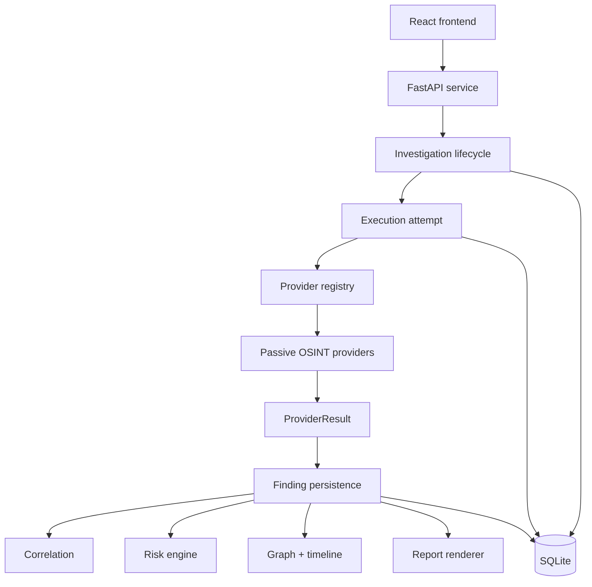

# Architecture

MailRecon is split into a React frontend, FastAPI service layer, provider modules, OSINT analyzers, risk engine, report renderer, and SQLite persistence.

## System flow

## Durable investigation path

The authoritative execution path is:

`Investigation → Execution → ExecutionAttempt → ModuleRun/Finding → derived views`

Provider execution follows:

`ProviderContext → ProviderDefinition/registry → ProviderRunner → ProviderResult → Finding persistence`

Derived outputs consume the current execution attempt where the API semantics require current-attempt data. Historical attempts remain available for comparison without being silently folded into the current intelligence view.

## Provider isolation

The orchestrator executes independent providers concurrently. A provider error, rate limit, unavailability or unconfigured service is recorded as an explicit operational state rather than being converted into negative intelligence or aborting the whole investigation.

## Evidence and risk

Findings carry provenance and evidence state. Correlation is deliberately probabilistic: shared infrastructure, usernames, avatars, DNS records and other weak signals are not treated as automatic identity proof. Risk is multidimensional and explainable, with each contribution represented by findings that an analyst can inspect.

## Resource and outbound controls

Passive providers share centralized outbound controls. Generic external URL handling is HTTPS-only, rejects URL userinfo, resolves and requires public destinations, pins the validated address for transport, disables redirects and enforces bounded response/request resources. Runtime accounting covers external HTTP activity and DNS/infrastructure budgets where applicable.

The application remains intentionally passive: it does not perform credential attacks, authentication bypass, CAPTCHA bypass, private-account access or password acquisition.

## Persistence and privacy

SQLite stores the local investigation lifecycle, findings, execution provenance and derived views. Privacy mode reduces raw provider-reference retention while preserving the normalized target and derived metadata needed for investigation continuity.

External-provider disclosure is explicit. Provider execution state and intelligence result state remain separate so operational failures are not misinterpreted as evidence.
